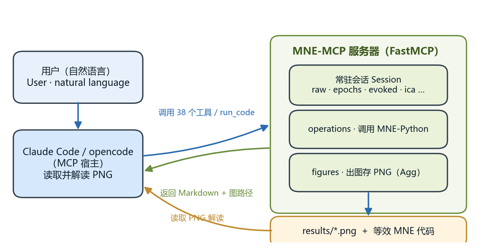
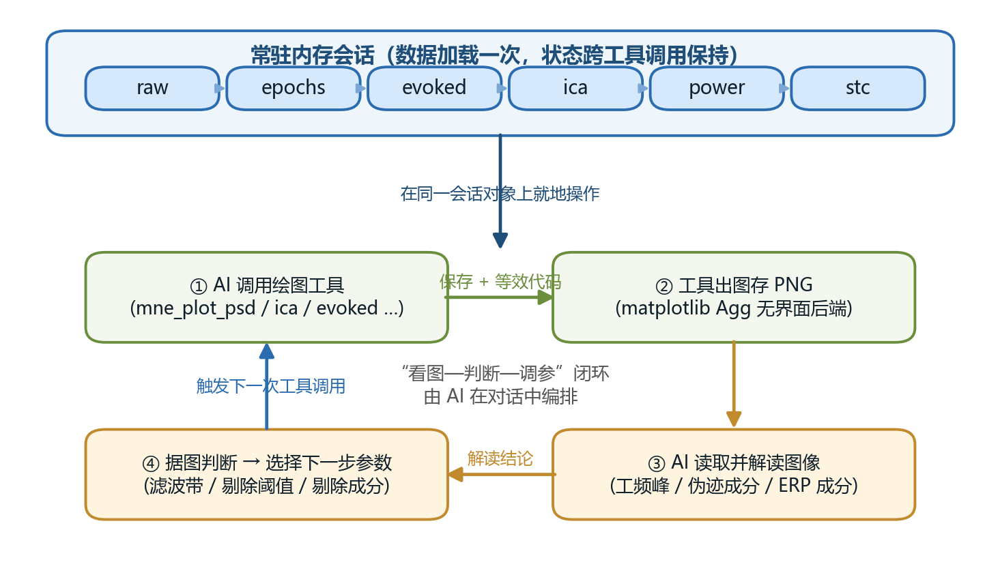
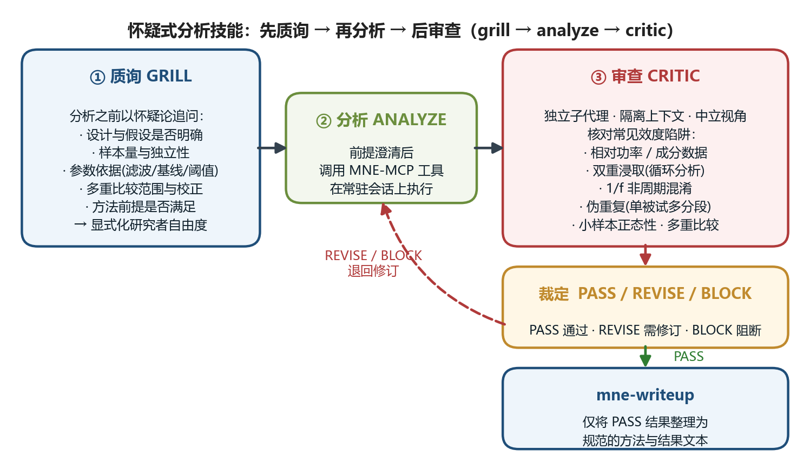
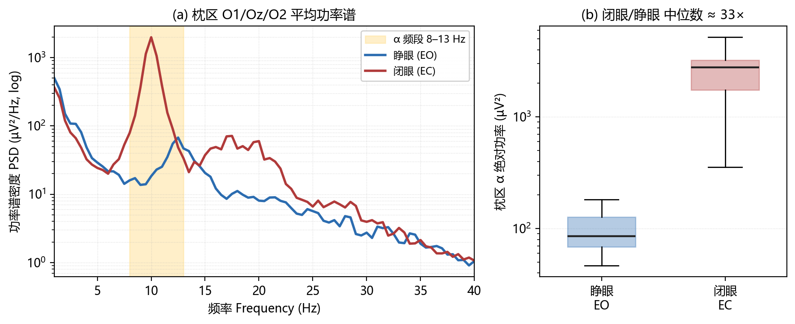

**MNE-MCP：基于 Claude Code 的神经电生理分析自动化系统**

[作者一]^1,2^，[作者二]^1,2^[^1]

(1 [单位一], [城市] [邮编]; 2 [单位二], [城市] [邮编])

**摘要：** 本文介绍了一种将 Claude Code 与开源神经电生理分析平台 MNE-Python 深度集成的方法，通过开发基于模型上下文协议（Model Context Protocol, MCP）的服务器（MNE-MCP），使 Claude Code 能够以自然语言对话的方式直接驱动 MNE-Python，完成脑电（EEG）、脑磁（MEG）、立体脑电（sEEG）、皮层脑电（ECoG）与功能近红外（fNIRS）数据的分析。与无状态、批处理式的统计软件不同，神经电生理分析是**有状态且强可视化**的：数据加载一次后需在同一份内存对象上连续完成滤波、独立成分分析（ICA）去伪迹、分段、叠加平均、时频与源分析，且几乎每一步都需"先看图、再决定参数"。针对这一特点，MNE-MCP 基于 FastMCP 框架构建了一个**常驻内存会话**，并为每个绘图工具实现了"自动出图—AI 读图"的闭环。服务器共提供 38 个工具，按功能分为 9 大类，覆盖从数据读取、预处理、ICA、事件分段、ERP/ERF 叠加、时频分析到源定位、连接性与解码的完整流程；对于工具未封装的需求，可经由通用工具 mne_run_code 在同一会话中直接执行任意 MNE 代码。在工具层之上，系统进一步提供一套遵循"先质询—再分析—后审查"（grill–analyze–critic）流程的 Agent 技能，并设有独立的方法学审查代理（critic agent），在结果被采纳前对其统计与科学有效性作出 PASS/REVISE/BLOCK 裁定，以缓解将研究者自由度"洗白"为权威结论的自动化偏误。本文详细说明了系统架构、核心设计理念与关键技术实现，报告了端到端验证结果，分析了系统的局限与风险，并针对神经科学研究人员提出了最佳实践建议，旨在借助 AI 辅助显著降低神经电生理分析的技术门槛，提升其效率、可及性与流程的可复现性。

**关键词：** 模型上下文协议；MNE-Python；脑电；脑磁；大语言模型；分析自动化；方法学审查

**MNE-MCP: An Automated Neurophysiological Analysis System Based on Claude Code**

[Author One]^1,2^ & [Author Two]^1,2,\*^

(1 [Affiliation One], [City] [Postcode], China; 2 [Affiliation Two], [City] [Postcode], China)

**Abstract:** This paper presents a framework for the deep integration of Claude Code with MNE-Python, an open-source platform for neurophysiological data analysis, via the Model Context Protocol (MCP). By developing a dedicated MCP server (MNE-MCP), the proposed method enables Large Language Models to drive MNE-Python directly through natural-language dialogue, performing analyses of electroencephalography (EEG), magnetoencephalography (MEG), stereo-EEG (sEEG), electrocorticography (ECoG), and functional near-infrared spectroscopy (fNIRS) data. Unlike stateless, batch-oriented statistical software, neurophysiological analysis is inherently *stateful and visual*: a recording is loaded once and then successively filtered, cleaned via Independent Component Analysis (ICA), epoched, averaged, and submitted to time-frequency and source analysis on the same in-memory object, with nearly every step requiring the analyst to "inspect a figure before choosing parameters." To accommodate this characteristic, MNE-MCP builds a single persistent in-memory session upon the FastMCP framework and implements an "automatic plotting—AI figure interpretation" loop for every visualization tool. The server provides 38 tools across nine functional categories, spanning the complete pipeline from data I/O, preprocessing, ICA, event-based epoching, ERP/ERF averaging, and time-frequency analysis to source localization, connectivity, and decoding; for needs not covered by a dedicated tool, the general-purpose mne_run_code tool executes arbitrary MNE code within the same session. Beyond the tool layer, the system further provides a suite of agent Skills that follow a grill–analyze–critic workflow, together with an independent methodology-critic agent that adjudicates the statistical and scientific validity of each result (PASS/REVISE/BLOCK) before it is adopted, mitigating the automation-bias risk of laundering researcher degrees of freedom into authoritative-sounding conclusions. This article elaborates on the system architecture, core design philosophy, and key technical implementation, reports end-to-end validation results, discusses the system's limitations and risks, and offers best-practice recommendations for neuroscience researchers, aiming to substantially lower the technical barrier of neurophysiological analysis while enhancing its efficiency, accessibility, and workflow reproducibility through AI-driven assistance.

**Keywords:** Model Context Protocol; MNE-Python; Electroencephalography; Magnetoencephalography; Large Language Model; Automated Analysis; Methodology Critique

**1 引言**

神经电生理技术是认知神经科学、临床脑科学与脑机接口研究的核心手段。脑电（EEG）、脑磁（MEG）、立体脑电（sEEG）、皮层脑电（ECoG）与功能近红外（fNIRS）等技术以毫秒级的时间分辨率记录大脑活动，被广泛用于事件相关电位（Event-Related Potential, ERP）、时频振荡、源定位与解码等研究。然而，从原始记录到可报告结果的分析流程相当复杂：研究者需要依次完成滤波与陷波、重参考、导联（montage）设置、坏导处理、独立成分分析（ICA）去伪迹、事件提取与分段、基线校正与试次剔除、叠加平均、时频分解，乃至源空间重建、连接性与多变量解码等步骤。这一流程不仅要求研究者具备扎实的信号处理与神经科学知识，还要求其熟练掌握相应的分析软件与编程接口。

MNE-Python 是当前国际上最主流的开源 M/EEG 分析平台之一(Gramfort et al., 2013, 2014)。它由 MNE-C 迁移至 Python 后逐步发展，流程完整（涵盖预处理、ICA、时频、源定位与统计），与 NumPy、SciPy、scikit-learn 等科学计算生态深度兼容(Harris et al., 2020; Pedregosa et al., 2011; Virtanen et al., 2020)，可视化能力强，并支持脑成像数据结构（Brain Imaging Data Structure, BIDS）标准与机器学习工作流(Pernet et al., 2019)。作为开源、透明且可复现的平台，MNE-Python 已成为认知神经科学、临床脑科学与脑机接口研究的重要基础设施。

尽管功能强大，MNE-Python 的使用门槛并不低。其一，应用程序接口（API）庞大，一个完整的分析流程往往需要编写数十行、数十个步骤的代码；其二，分析过程是**强交互**的——几乎每一步都需要先"看图"（如功率谱、ICA 成分地形图、ERP 波形与地形图）才能决定下一步的参数，例如依据功率谱判断工频干扰、依据成分地形图与时间序列识别眼电（EOG）或心电（ECG）伪迹；其三，新手需要记忆大量约定，如信号单位以伏特（V）存储、ICA 应在约 1 Hz 高通后的数据上拟合、绘制地形图前须先设置导联位置等，稍有不慎便会出错。相较之下，部分图形界面驱动的脑电分析软件（如 EEGLAB 等开源工具(Delorme & Makeig, 2004)以及若干商业软件）虽降低了编程门槛，但在可复现性、跨平台性与可扩展性方面往往受限，且菜单式操作难以完整记录分析流程。

大语言模型（Large Language Models, LLMs）的快速发展为降低分析门槛提供了新的路径。OpenAI 推出的 ChatGPT Code Interpreter（后更名为 Advanced Data Analysis）展示了 LLM 通过编写并执行代码完成数据分析任务的能力：用户以自然语言描述需求，系统自动生成代码、执行计算并返回结果。近期研究进一步系统评估并推进了 LLM 在统计与数据科学领域的应用，包括面向数据科学的 LLM 智能体能力综述(Rahman et al., 2025)以及端到端数据科学智能体框架(Hong et al., 2024)。然而，现有方案大多面向通用数据科学，并未针对神经电生理流程的两项特点进行优化：其一，若以一次性、彼此独立的代码单元组织分析，跨步骤的大型内存对象不易维持，数 GB 的记录可能被反复重载；其二，分析决策高度依赖对中间图像的判读，而通用范式通常不把"生成图像—解读图像—据此决定下一步"作为一等公民的交互回路。

模型上下文协议（Model Context Protocol, MCP）是 Anthropic 于 2024 年发布的开放标准，旨在解决 LLM 应用与外部工具/数据源集成的标准化问题(Anthropic, 2024; Google Cloud, 2025)。MCP 采用客户端—服务器架构，定义了工具（Tools）、资源（Resources）与提示词（Prompts）三类核心能力，MCP 服务器通过标准输入/输出（stdio）或 HTTP 等传输方式与宿主（如 Claude Code）通信，从而消除为每个 LLM 应用单独开发集成接口的重复工作。FastMCP(Lowin, 2024)是 MCP 协议的轻量级 Python 实现，提供基于装饰器的工具注册机制与内置的异步支持，显著简化了 MCP 服务器的开发。MNE-MCP 即基于 FastMCP 框架构建。Claude Code 则是一种面向终端与开发环境的智能体式编程工具，能够读取项目上下文、编辑文件、执行命令，并通过 MCP 连接外部工具与分析服务；研究者因而可以直接以自然语言提出任务，由系统自动完成工具调用、参数组织与结果整合。

本文提出了一个基于 MCP 协议的 MNE 服务器 MNE-MCP，将 Claude Code 接入 MNE-Python，形成从自然语言指令到 MNE 流程编排、执行与结果（含图像）回传与解读的端到端工作流程。针对神经电生理分析"有状态、强可视化"的本质，系统采用常驻内存会话与"自动出图—AI 读图"闭环这两项核心设计，并实现了覆盖常见流程与高级分析的 38 个结构化工具及一个通用代码执行工具；本文给出关键实现细节、端到端验证、局限分析与使用建议，并以 MIT 许可证开源发布项目代码，便于复用与扩展。

**2 核心技术实现**

**2.1 整体架构**

MNE-MCP 的整体架构由以下核心模块构成：Claude Code（MCP 宿主）、基于 FastMCP 的服务器层（server.py，负责 38 个工具的薄封装定义）、MNE 操作实现层（operations.py，封装真正的 MNE-Python 调用）、持久会话与代码执行内核（kernel.py，维护内存对象、执行 mne_run_code 并捕获图像）、图像捕获模块（figures.py，以无界面后端将 matplotlib 图保存为 PNG）、对象摘要模块（summaries.py，生成可读的对象摘要）、配置与能力检测模块（config.py，含可配置默认值）、交互式配置向导（wizard.py）、客户端配置写入模块（claude_config.py，自动注册到 Claude Code 等客户端）以及命令行入口（cli.py），底层依赖 MNE-Python 及其科学计算生态。

Claude Code 通过 MCP 协议（stdio 传输）与 FastMCP 服务器通信。服务器进程内**仅维护一个会话**，持有命名的 MNE 对象（如 raw、epochs、evoked、ica 等），并在跨工具调用之间保持其状态；所有执行均经由锁串行化，以避免并发调用时 matplotlib 全局状态与会话对象发生竞争。绘图工具采用无界面的 Agg 后端(Hunter, 2007)，将结果保存为 PNG 并返回路径，供宿主读取与解读；每次工具调用的返回结果中还附带"等效 MNE 代码"，便于复现与归档。系统的整体数据流如图 1 所示。

**图 1　MNE-MCP 系统架构与数据流**

**2.2 核心设计理念：有状态会话与"自动出图—AI 读图"闭环**

神经电生理分析与无状态、批处理式的统计软件存在本质差异，这决定了 MNE-MCP 不同的设计取向。第一，**常驻内存会话**。数据只加载一次，随后的滤波、重参考、标记坏导、ICA、分段、叠加平均等操作均在同一份内存对象上连续完成，无需在步骤之间反复读取体积可达数 GB 的原始文件。会话以名称索引对象（raw、epochs、evoked、ica、power、stc 等），使多步、跨工具的流程得以自然衔接，这正是单次代码执行范式难以高效支持的场景。

第二，**"自动出图—AI 读图"闭环**。神经电生理分析的几乎每一步决策都依赖视觉判断：依据功率谱定位工频峰与坏导、依据 ICA 成分地形图与时间序列识别眼电/心电成分、依据 ERP 波形与地形图判断 N1、P2、P300 等成分。为此，MNE-MCP 的每个绘图工具都将图像保存为 PNG 并返回路径，宿主中的 AI 助手随即**读取并解读**该图像，再据此决定后续参数。如此便把"看图—判断—调参"的人工循环转化为可由 AI 编排的对话流程（见图 2）。需要指出的是，AI 对图像的判读是辅助性的，其准确性依赖所用模型，研究者仍须确认（详见第 4 节局限分析）。

**图 2　常驻内存会话与"自动出图—AI 读图"闭环**

第三，**结构化工具与通用补充工具相结合**。38 个结构化工具覆盖常见流程与高级分析（源定位、连接性、解码）；对于工具尚未封装的需求（如 BIDS 读写、自定义统计、波束成形、自动试次剔除等），可通过通用工具 mne_run_code 在同一会话中直接编写并执行 MNE 代码。该工具预绑定了 mne、np、pd、plt 及全部已加载对象，并以类笔记本的方式返回末行表达式的值、捕获标准输出与图像，从而在保持易用性的同时不损失 MNE-Python 的完整能力——新手可循结构化工具跑通完整流程，专家则可借通用工具不受限地扩展。

第四，**可配置默认值**。工频（50/60 Hz）、默认导联、滤波带、试次剔除阈值、ICA 方法与成分数、分段时窗、结果目录与超时等参数，均可通过交互式向导 mne-mcp configure 一次设定；当工具调用省略相应参数时自动套用，并可用 mne_get_config 查看当前配置。配置的优先级为：环境变量 > 配置文件 > 内置默认值。

**2.3 工具设计模式**

MNE-MCP 共提供 38 个 MCP 工具，按功能分为 9 大类（见表 1），覆盖神经电生理研究从数据读取到结果导出的完整流程。绝大多数工具遵循统一的设计模式：

能力检测 → 调用 MNE 操作 → 捕获图像（如有）→ 生成可读摘要与等效代码 → Markdown 返回

具体而言，工具函数首先检测所需能力是否可用（如 ICA 依赖 scikit-learn、高级分析依赖 [full] 额外依赖），若不可用则提前返回可诊断的提示；随后调用 operations.py 中对应的 MNE 操作，在持久会话上就地修改或新建命名对象；对于绘图工具，则经由无界面后端将图像捕获为 PNG；最后将对象的可读摘要、图像路径与"等效 MNE 代码"组织为 Markdown 字符串返回。这种统一模式既保证了返回结果对 AI 助手的可解析性，又通过等效代码保障了分析的可复现性。

此外，系统提供通用工具 mne_run_code，用于在同一会话中直接执行任意 MNE/Python 代码，适用于超出既有工具封装范围的分析需求或探索性与高级定制场景。在工具层之上，系统还配套了一套 Agent 技能与一个方法学审查代理，把"该不该这么做、做得是否正确"前置为可审计的流程，详见 2.4 节。

**表 1　MNE-MCP 工具分类汇总（38 个工具，9 类）**

| 类别 | 工具名 | 功能要点/说明 |
|---|---|---|
| 状态与会话 (7) | mne_check_status | 检测 MNE/scikit-learn/numpy 等版本与运行目录，建议首先调用 |
| | mne_session_info | 列出会话中所有已加载对象的一行摘要 |
| | mne_describe | 给出单个对象的详细摘要（通道、采样率、滤波带、坏导、导联、时长等） |
| | mne_get_info | 列出逐通道信息（名称、类型、坏导标记）与测量信息 |
| | mne_reset_session | 清空所有对象与图像（不可逆） |
| | mne_run_code | 在会话中执行任意 MNE/Python 代码；通用"逃生舱" |
| | mne_get_config | 显示工具回退所用的可配置默认参数 |
| 数据读取 (2) | mne_list_files | 列出目录中的神经数据文件（.fif/.edf/.bdf/.vhdr/.set/.cnt 等） |
| | mne_load_raw | 按扩展名自动识别格式并加载记录至会话 |
| 预处理 (7) | mne_filter | 高通/低通带通与工频陷波（如 ERP 常用 0.1–40 Hz, 50 Hz） |
| | mne_resample | 重采样（建议尽量在分段后进行以保留事件） |
| | mne_crop | 裁剪时间窗 |
| | mne_set_montage | 设置导联位置（standard_1020、biosemi64、GSN-HydroCel-128 等） |
| | mne_set_reference | 重参考（平均参考、REST 或指定通道） |
| | mne_mark_bad_channels | 标记坏导 |
| | mne_interpolate_bads | 样条插值坏导（需先设置导联） |
| 可视化 (3) | mne_plot_psd | 功率谱（定位工频与坏导） |
| | mne_plot_raw | 信号波形 |
| | mne_plot_sensors | 电极布局（topomap / 3d） |
| ICA (4) | mne_fit_ica | 拟合 ICA（fastica/infomax/picard；建议在约 1 Hz 高通数据上拟合） |
| | mne_plot_ica_components | 成分头皮地形图 |
| | mne_plot_ica_sources | 成分时间序列 |
| | mne_apply_ica | 剔除指定成分（如 exclude="0,3"） |
| 事件/分段/ERP (7) | mne_find_events | 从触发通道提取事件 |
| | mne_events_from_annotations | 从注释（EDF/BrainVision/EEGLAB）提取事件 |
| | mne_make_epochs | 分段（命名条件、基线、按峰峰值剔除） |
| | mne_plot_epochs_image | 分段×时间热图 |
| | mne_average_evoked | 叠加平均得到 ERP/ERF |
| | mne_plot_evoked | 绘制诱发响应（joint/topo/butterfly） |
| | mne_plot_topomap | 地形图（auto/peaks/指定时刻） |
| 时频 (1) | mne_tfr_morlet | Morlet 小波时频功率（需分段足够长以容纳最低频率） |
| 高级分析 (6) | mne_decode | 时间分辨解码（MVPA）：逐时刻分类器区分两条件并交叉验证 |
| | mne_connectivity | 频段内通道×通道谱连接性（coh/plv/wpli 等） |
| | mne_compute_noise_cov | 由分段基线估计噪声协方差（逆算子前提） |
| | mne_make_forward | 模板头（fsaverage）EEG 正向模型 |
| | mne_apply_inverse | 估计皮层源活动（dSPM/MNE/sLORETA/eLORETA） |
| | mne_plot_source_estimate | 将源估计渲染为皮层地图 |
| 导出 (1) | mne_save | 按类型规范命名保存对象（Raw→*_raw.fif，Epochs→*-epo.fif，Evoked→*-ave.fif） |

> 注：高级分析（解码/连接性/源定位）需安装 [full] 额外依赖（pip install -e ".[full]"），其中包含 scikit-learn、mne-connectivity、mne-bids、autoreject、nibabel、pyvista、python-picard 等。支持读取的格式包括 FIF、EDF、BDF、BrainVision(.vhdr)、EEGLAB(.set)、CNT、EGI/.mff、CTF(.ds)、SNIRF 等。

**2.4 Agent 技能体系与方法学审查代理**

如果说 38 个结构化工具解决的是"能做什么"，那么 Agent 技能（Skills）解决的则是"该不该这么做、做得是否正确"。技能是一种将任务所需的指令、脚本与参考资源以文件夹形式组织、并在相关任务触发时按需加载（渐进式披露）的机制(Anthropic, 2025)：模型平时只见到技能的简短描述，仅当任务匹配时才载入其完整正文与参考文件，从而在不挤占上下文的前提下注入领域专长。MNE-MCP 共提供 14 个技能，可分为三层。

第一层是**通用流程与技术防错**。mne-analyst 固化标准分析流程、参数约定与图像解读指引，并将每步的图像与等效代码按序号归档至工作目录的 mne_result/，使整套分析可审计、可复算；mne-mcp-guard 则聚焦**技术性**陷阱的预防与诊断，如信号单位（伏特与微伏）混淆、绘制地形图前未设置导联、ICA 未在高通数据上拟合、时频小波窗长不足、分段为空或被过度剔除、以及耗时步骤超时等。这一层关注的是**执行层面的可靠性**——让分析"跑得通、跑得对"。

第二层是**按分析大类组织的"怀疑式"技能**。系统为预处理、伪迹去除、ERP、频谱、时频、连接性、源定位、解码、统计与进阶方法各提供一个技能，共同覆盖 MNE 支持的主要分析门类（含使用相对较少的高级方法）。每个技能都遵循统一的"先质询—再分析—后审查"（grill → analyze → critic）三阶段流程（见图 3）：(1) **质询（grill）**——在动手之前以怀疑论姿态就研究设计与关键决策向用户追问：实验设计与假设是否明确、样本量与独立性、参数选择的依据（滤波带、基线、剔除阈值、频段定义、时窗）、多重比较的范围与校正计划、以及拟用方法的前提条件是否满足，其目的在于把隐含的**研究者自由度（researcher degrees of freedom）**显式化，避免"先跑出结果再找解释"；(2) **分析（analyze）**——在关键前提澄清后，调用相应的 MNE-MCP 工具执行分析；(3) **审查（critic）**——分析完成后交由独立的方法学审查者对结果的统计与科学**有效性**把关。

第三层即上述审查者——**方法学审查代理（critic agent）**。它不仅是一个技能，更被实现为一个真正的**子代理（subagent）**：在与主对话相隔离的上下文中运行，仅接收待审分析的方法与结果，从而以"未被前文说服"的中立视角进行审查，避免主对话已形成的叙述污染判断。审查代理依据一份方法学检查清单对常见效度陷阱作出裁定，包括但不限于：以相对功率（占总功率之比）作为依赖变量时的**成分数据（compositional data）**问题——各频段比例之和恒为 1、彼此非独立，普通参数检验的前提被破坏；在同一份数据上既用于定义感兴趣的区间/通道/成分、又用于统计推断的**循环分析 / 双重浸取（double dipping）**(Kriegeskorte et al., 2009)；将振荡功率变化与 **1/f 非周期（aperiodic）**背景的斜移相混淆、未先分离周期与非周期成分(Donoghue et al., 2020)；把来自同一被试的多个试次或分段当作独立样本的**伪重复（pseudoreplication）**(Lazic, 2010)；小样本下对正态性的无依据假定；以及多重比较未作校正等。审查以三档裁定结束——**PASS（通过）/ REVISE（需修订）/ BLOCK（阻断）**：REVISE 给出具体的修订建议，BLOCK 则标识会使结论失效的根本性缺陷。仅当结果通过审查后，写作技能 mne-writeup 才将其整理为规范的方法与结果文本，从源头上抑制把存疑分析"洗白"为权威结论的倾向。

**图 3　怀疑式分析技能的三阶段流程：质询 → 分析 → 审查（grill → analyze → critic）**

值得强调的是，本系统刻意将"**技术防错**（mne-mcp-guard）"与"**方法学审查**（mne-methodology-critic）"分置两层：前者保证分析在执行层面不出错（跑得通、单位正确、不超时），后者则追问分析在科学层面是否成立（推断是否有效、自由度是否被滥用）。二者解决的是不同性质的问题，分离设计使每层职责清晰、可独立审计。

作为一个具体例证：在本文作者使用本系统复现 Berger 效应（睁眼/闭眼枕区 α）的一次真实分析中，方法学审查代理识别出"将来自单个被试的 30 个连续 2 秒分段当作独立样本进行检验"属于伪重复，遂返回 REVISE 裁定；据此，相应的 p 值被改述为仅具描述性意义，群体层面的推断被明确标注为需多被试设计。这一过程表明，该审查机制能够对系统**自身产出**的分析提出实质性的方法学质疑，而非仅作形式化附和——这正是缓解第 4 节所述自动化偏误（automation bias）风险的关键设计。

**表 2　MNE-MCP 的 Agent 技能体系（14 个技能，含 1 个兼任子代理的方法学审查者）**

| 层次 | 技能 | 角色与关注点 |
|---|---|---|
| 通用流程 | mne-analyst | 标准流程、参数约定、图像解读，按序号归档至 mne_result/（可复现） |
| 技术防错 | mne-mcp-guard | 单位、导联前置、ICA 高通、时频窗长、空/过剔分段、超时等**执行**陷阱 |
| 怀疑式分析（按大类） | mne-preprocess / mne-artifacts / mne-erp / mne-spectral / mne-timefreq / mne-connectivity / mne-source / mne-decoding / mne-stats / mne-advanced | 各分析门类的"质询—分析—审查"流程；覆盖常用与冷门方法 |
| 方法学审查 | mne-methodology-critic（兼子代理） | 在**隔离上下文**中审查统计/科学**有效性**，裁定 PASS/REVISE/BLOCK |
| 规范写作 | mne-writeup | 仅将**通过审查**的结果整理为规范的方法与结果文本 |

**2.5 错误处理与容错机制**

系统实现了多层次的错误处理与容错策略。首先，在能力检测层面，工具在执行前检测所需依赖是否可用：ICA 需要 scikit-learn，源定位、连接性与解码等高级分析需要 [full] 额外依赖；当依赖缺失时，工具提前返回明确的、可诊断的提示，而非在运行中途以晦涩的异常中断。其次，为避免在大型文件或耗时算法（如 ICA、时频分解、源重建）下出现不可控的等待，所有操作均设置了可配置的超时阈值（默认 300 秒，可经环境变量 MNE_MCP_TIMEOUT 调整），从而在运行时间异常延长时主动中止并返回信息。再次，在并发治理层面，所有执行经由锁串行化，绘图统一采用无界面的 Agg 后端，从机制上避免并发调用时 matplotlib 全局状态与会话对象之间的竞争。最后，配套的 mne-mcp-guard 技能在分析前对常见陷阱（单位伏特与微伏混淆、导联未设置、ICA 未高通、时频窗长不足、分段为空或被过度剔除、超时等）进行预防与诊断，将易错环节前置为可审计的检查项。

**2.6 测试与验证**

本项目通过单元测试、端到端冒烟测试与持续集成三个层面验证系统的正确性。单元测试层面，项目包含 59 个测试函数（语句覆盖率约 71%），覆盖配置优先级、多客户端注册的幂等合并、持久内核与会话对象管理、各 MNE 操作的返回结构、命令行接口与服务器工具注册等关键行为，并为已修复的缺陷保留回归测试。持续集成（GitHub Actions）在 Linux/macOS/Windows × Python 3.10/3.12 上运行测试，并设有 NumPy 1.x/2.x 兼容性矩阵与代码风格检查，以保证跨平台、跨依赖版本的可靠性。

端到端层面，项目提供一套在合成 EEG 数据上运行、无需任何外部下载的冒烟流程，按真实分析顺序串联操作层、持久内核与图像捕获，并以 21 项断言校验每一步的预期结果（见表 3）。该流程从加载 .fif 记录开始，依次完成导联设置、带通与陷波滤波、平均参考、功率谱与电极布局绘制、ICA 拟合与成分绘制与应用、（经 mne_run_code 注入）事件构造、分段、分段热图、叠加平均、诱发响应与地形图绘制、Morlet 时频分解，并验证 mne_run_code 同时正确捕获标准输出、返回值与图像，最后核对会话摘要与对象保存。21 项断言全部通过，表明结构化工具、持久会话与图像捕获三者在完整流程中协同工作正常。

需要说明的是，上述验证确立的是系统的**功能正确性与流程集成**——即工具、持久会话与图像捕获能够在完整流程中协同运行——而各统计量的**数值精度则继承自底层的 MNE-Python**，本系统的结构化工具为薄封装，并未重新实现数值算法。因此，本文所称"可复现性"主要指工作流层面的可复现：每步返回的等效代码与按序号归档机制，使同一分析可被审计、复算与共享；而对特定数据集上已知结果的数值复现，仍取决于 MNE-Python 本身。作为真实数据层面的验证，持续集成中纳入了一例公开数据端到端测试：对 PhysioNet eegbci 数据集某被试的睁眼与闭眼静息记录，经标准预处理与逐段功率谱估计后，枕区 α（8–13 Hz）绝对功率在闭眼时显著高于睁眼（中位数约 33 倍），稳健复现了经典的 Berger 效应（见图 4）；该用例同时覆盖了真实 EDF 读取路径（此前仅合成数据未触及）。这表明系统不仅在合成数据上流程正确，也能在真实数据上给出与既有神经科学结论一致的结果——当然，该用例为单被试演示，群体层面的推断仍需多被试设计。

**图 4　真实数据（PhysioNet eegbci S001）上的 Berger 效应：(a) 枕区 O1/Oz/O2 平均功率谱在闭眼时于 α 频段（8–13 Hz）出现明显峰；(b) 逐段枕区 α 绝对功率闭眼显著高于睁眼（中位数约 33 倍）**

**表 3　MNE-MCP 端到端冒烟流程（合成 EEG，21 项断言）**

| 阶段 | 工具/操作 | 校验要点 |
|---|---|---|
| 数据读取 | load_raw | 经真实 IO 加载 *_raw.fif，会话中存在 raw 对象 |
| 预处理 | set_montage | 设置 standard_1020 导联，等效代码正确 |
| 预处理 | filter（带通+陷波） | 1–40 Hz 带通叠加 50 Hz 陷波 |
| 预处理 | set_reference | 平均参考（set_eeg_reference） |
| 可视化 | plot_psd | 生成并保存功率谱 PNG |
| 可视化 | plot_sensors | 生成电极布局图 |
| ICA | fit_ica | 拟合 ICA，会话中存在 ica 对象 |
| ICA | plot_ica_components | 生成成分地形图 |
| ICA | apply_ica（exclude=0） | 正确剔除指定成分 |
| 事件 | run_code 构造事件 | 经通用工具注入合成事件，无错误 |
| 分段 | make_epochs | 生成 epochs 对象 |
| 分段 | plot_epochs_image | 生成分段×时间热图 |
| ERP | average_evoked | 生成 evoked 对象 |
| ERP | plot_evoked（joint） | 生成诱发响应联合图 |
| ERP | plot_topomap | 在指定时刻生成地形图 |
| 时频 | tfr_morlet | 在更宽时窗上生成 Morlet 时频功率图 |
| 通用 | run_code 标准输出 | 正确捕获 stdout |
| 通用 | run_code 返回值 | 正确返回末行表达式的值 |
| 通用 | run_code 图像捕获 | 正确捕获 matplotlib 图像 |
| 会话 | session summary | 摘要中正确列出 raw/epochs/evoked/ica |
| 导出 | save | 成功保存 evoked 对象至磁盘 |

**2.7 与传统工作流的对比分析**

表 4 从多个维度比较了 MNE-MCP 辅助工作流与两种传统方式（直接编写 MNE 代码、以及图形界面/商业脑电软件）的差异。需要强调的是，对比旨在刻画交互方式的取舍，而非否定其他方式：手写代码在确定性与精确复现上具有优势，图形界面在零编程上手上具有优势。

**表 4　MNE-MCP 工作流与传统工作流对比**

| 对比维度 | 直接编写 MNE 代码 | 图形界面/商业软件 | MNE-MCP 工作流 |
|---|---|---|---|
| 操作方式 | 手写 Python 代码 | 菜单点击 | 自然语言指令 |
| 状态保持 | 脚本内变量 | 软件内会话 | 常驻内存会话，跨工具保持 |
| 看图决策 | 自行绘图并判读 | 自行查看并判读 | AI 自动读图并解读后建议参数（准确性依赖模型，需人工确认） |
| 方法编排 | 需自行查阅 API 与最佳实践 | 受限于软件菜单 | AI 按最佳实践编排流程 |
| 可复现性 | 代码精确、可确定性复现 | 菜单操作难以记录 | 每步返回等效代码并可归档（编排过程为非确定性） |
| 确定性与成本 | 确定性高，无模型调用成本 | 确定性较高 | LLM 编排存在非确定性，有调用成本与延迟 |
| 可扩展性 | 完整（全 Python 生态） | 受限于软件功能 | 结构化工具 + mne_run_code 不受限 |
| 跨平台 | 是（纯 Python） | 常受限于操作系统/授权 | 是（Windows/macOS/Linux） |
| 学习成本 | 需掌握编程 + 信号处理 + 神经科学 | 需掌握软件操作 | 理解概念即可，专家可深入 |
| 输出形式 | 代码与图像 | 软件内查看器 | Markdown + 图像 + 等效代码 |

**3 针对神经科学用户的使用建议**

**3.1 系统要求与安装配置**

MNE-MCP 的运行环境要求较为宽松：Python 3.10 及以上版本，MNE-Python 1.6 及以上（作为依赖自动安装）；ICA 需要 scikit-learn（ica 额外依赖），源定位、连接性与解码等高级分析需要 full 额外依赖。由于 MNE-Python 为纯 Python 实现，系统可跨平台运行于 Windows、macOS 与 Linux，并可接入 Claude Code、Codex、opencode 等任意支持 MCP 的客户端。

推荐通过源码安装。基础安装（含 ICA）如下：

> git clone https://github.com/Exekiel179/MNE-MCP.git
>
> cd MNE-MCP
>
> pip install -e ".[ica]"

随后运行一条命令即可完成多客户端注册与技能安装：

> mne-mcp setup

该命令将 mne 服务器注册到 Claude Code、Codex 与 opencode（可用 --clients 限定），并安装配套的全部 Agent 技能（mne-analyst、mne-mcp-guard 及 2.4 节所述的按分析大类组织的怀疑式技能套件）与方法学审查子代理，同时为其改动的任何配置文件写入带时间戳的备份。由于 MCP 服务器在客户端启动时加载，安装后需重启一次客户端，mne_* 工具方可生效。项目亦提供一键安装脚本（Windows 下的 install.ps1 与 macOS/Linux 下的 install.sh），自动完成创建虚拟环境、安装、验证、注册与技能安装。此外，本系统已按标准 MCP 分发方式发布至 PyPI，并在官方 MCP 注册表（registry.modelcontextprotocol.io）以 io.github.Exekiel179/mne-mcp 登记；客户端无需克隆即可以 uvx --from "mne-mcp[ica]" mne-mcp serve 按需运行，或以 pipx install "mne-mcp[ica]" 持久安装（鉴于依赖较重，持久安装通常更为流畅；其中 [ica] 额外依赖启用 ICA，需要源定位、连接性、解码等高级工具时改用 [full]）。

安装完成后，可在命令行运行 mne-mcp status 检查环境，或在对话中请助手调用 mne_check_status 进行自检。若需调整默认参数（工频、默认导联、滤波带、剔除阈值、ICA 设置、分段时窗、目录与超时等），可运行交互式向导 mne-mcp configure（mne-mcp configure --show 查看当前配置，--reset 恢复默认）。

**3.2 典型使用场景与操作建议**

在正式分析前，建议研究者先借助 Claude Code 对数据进行整体概览：请其列出数据目录中的记录、加载目标文件并描述其基本信息（通道、采样率、时长、导联等），并查看功率谱以判断工频干扰与可疑坏导。该步骤有助于在分析前及时发现采样率异常、单位错误、坏导与电源干扰等问题，为后续参数选择提供可靠基础。

预处理阶段，研究者可用口语化方式描述意图，例如要求对记录做 0.1–40 Hz 带通与 50 Hz 陷波、设置 standard_1020 导联、标记并插值坏导、改用平均参考。建议在提问中明确工频（中国大陆为 50 Hz）与导联系统，以便系统套用正确参数（需注意，当低通截止已低于工频时，陷波并非必需；陷波主要用于保留高频成分的宽带或时频分析流程）。此外，ICA 应在约 1 Hz 高通后的数据上拟合，系统与配套技能会就此给出提示。

伪迹去除阶段，研究者可请助手拟合 ICA、绘制成分地形图与时间序列，并据图识别眼电、心电等伪迹成分后将其剔除。由于系统会读取并解读成分图像，识别与剔除的建议可在对话中直接给出，研究者确认后即可应用。

事件分段与 ERP 阶段，研究者应明确事件来源（触发通道或注释）、条件命名与编码、分段时窗与基线，以及试次剔除阈值（如 100 µV 峰峰值）。系统在叠加平均后可绘制 ERP 波形与多个时刻的地形图，便于直接用于结果呈现。对于时频分析，需注意分段长度应足以容纳所关注的最低频率，且低频成分在分段边缘附近受小波长度影响，解读时应避开边缘区间。

对于源定位、连接性与解码等高级分析，需预先安装 full 额外依赖。研究者可请助手由基线估计噪声协方差、构建模板头正向模型、应用逆算子（如 dSPM）估计皮层源活动并渲染源地图；亦可在指定频段计算通道间谱连接性，或对两条件进行时间分辨解码(King & Dehaene, 2014)。需注意，基于模板头（fsaverage）的 EEG 源定位仅为近似：未使用被试个体 MRI、采用假定的边界元（BEM）电导率与名义电极坐标，会带来空间上不均匀的定位误差，其结果宜作探索性参考；如需定量可靠的源估计，建议使用个体 MRI、精确的 BEM 与经数字化配准的电极坐标。对于工具尚未封装的需求（如 BIDS 读写、自动试次剔除(Jas et al., 2017)、波束成形或自定义统计），可请助手通过 mne_run_code 在同一会话中直接编写代码完成。

为提升可靠性与可复现性，建议安装并使用配套技能。mne-analyst 将标准流程、参数约定与图像解读指引固化为可复用的工作流，并将图像与等效代码按序号归档至工作目录的 mne_result/，使整套分析可复现；mne-mcp-guard 则在关键步骤前进行防错检查。对于拟用于发表的确证性分析，建议进一步启用 2.4 节所述按分析大类组织的怀疑式技能与方法学审查代理，让关键的统计与有效性判断在结果被采纳前接受一次独立审查（PASS/REVISE/BLOCK），以降低将存疑的研究者自由度误作稳健结论的风险。此外，可在项目根目录的 CLAUDE.md 中以记忆形式集中记录项目级约定（如默认数据目录、工频与导联系统、坏导清单、ERP 分段与剔除口径、报告格式等），使模型在跨会话交互中自动遵循一致的前提与参数设定，并为过程审计提供可追溯的依据。

**3.3 自然语言交互示例**

以下示例展示了 Claude Code 在接收自然语言请求后自动编排 MNE-MCP 工具、读取图像并解读、最终完成一个典型 ERP 流程的过程。为聚焦交互逻辑，示例对系统返回内容做了精简，图像以路径与解读文字示意；其中的版本号、事件计数与波形解读均为示例性说明，而非来自真实数据的测量结果。

**【用户】**

> 加载 sub-01_raw.fif，我想做一个视觉 oddball 范式的 ERP 分析，比较 target 和 standard 两种刺激。先看看数据情况。

**【Claude】**

> 好的，先自检环境并加载数据。
>
> [调用] mne_check_status → MNE 1.7（示例）可用，scikit-learn 可用 ✅
> [调用] mne_load_raw("sub-01_raw.fif") → 64 导 EEG，采样率 1000 Hz，时长约 12 分钟
> [调用] mne_plot_psd("raw") → 图：results/psd_01.png
>
> 功率谱在 50 Hz 处有明显工频峰，另外 T7 通道整体功率偏高，疑似坏导。建议：0.1–40 Hz 带通 + 50 Hz 陷波，并把 T7 标为坏导后插值。要按这个方案处理吗？

**【用户】**

> 可以，按你说的来，导联是标准 64 导。

**【Claude】**

> [调用] mne_set_montage("raw", "standard_1020")
> [调用] mne_filter("raw", l_freq=0.1, h_freq=40, notch=50)
> [调用] mne_mark_bad_channels("raw", bads="T7") → [调用] mne_interpolate_bads("raw")
> [调用] mne_set_reference("raw", "average")
>
> 已完成滤波、坏导插值与平均参考。接下来做 ICA 去眼电——按惯例我会在约 1 Hz 高通的数据副本上拟合，以获得更稳定的成分。

**【用户】**

> 好，去掉眼电就行。

**【Claude】**

> [调用] mne_run_code（在 1 Hz 高通副本上拟合）→ [调用] mne_fit_ica → [调用] mne_plot_ica_components → 图：results/ica_components_01.png
>
> 成分 0 呈前额对称分布、时间序列与眨眼一致，判断为垂直眼电（眨眼）成分（水平眼动则表现为前额左右反相的地形）；成分 4 的时间序列呈与心搏一致的周期性，疑似心电。建议剔除成分 0（眼电）。
>
> [调用] mne_apply_ica(exclude="0") → 已去除眼电成分。

**【用户】**

> 现在做分段和叠加，target 和 standard 都要，看看 P300。

**【Claude】**

> [调用] mne_find_events("raw") → 找到 480 个事件
> [调用] mne_make_epochs(event_id="target:1,standard:2", tmin=-0.2, tmax=0.8, reject_eeg=100e-6) → 剔除 23 个超阈试次，余 457 个
> [调用] mne_average_evoked(condition="target", evoked_name="evoked_target")
> [调用] mne_average_evoked(condition="standard", evoked_name="evoked_standard")
> [调用] mne_plot_evoked("evoked_target", style="joint") → 图：results/evoked_target_01.png
> [调用] mne_plot_topomap("evoked_target", times="0.17,0.35") → 图：results/topo_01.png
>
> target 条件在约 300 ms 之后出现明显的中央—顶区正走向（P3b/P300），standard 条件则不明显；两条件在约 170 ms 均可见枕颞区 N1。需要强调的是，以上为单被试、肉眼观察的示例性判断，正式推断仍需在组水平上做差异波与基于置换的统计检验。需要我做两条件差异的统计或时频分析吗？

**【用户】**

> 顺便看一下顶区的时频，然后把结果都保存了。

**【Claude】**

> 时频分析需要更长的时窗以容纳低频成分，我先在 −0.5 至 1.0 s 上重新分段，再做 Morlet 变换。
>
> [调用] mne_make_epochs(..., tmin=-0.5, tmax=1.0, epochs_name="epochs_tfr")
> [调用] mne_tfr_morlet("epochs_tfr", fmin=4, fmax=40) → 图：results/tfr_Pz_01.png
> [调用] mne_save("evoked_target", "sub-01_target-ave.fif") 等
>
> 时频图（顶区，跨试次的总功率）显示刺激后 θ 频段（约 4–7 Hz）在约 300–500 ms 出现功率增强；这是与 P300 常见的共现振荡相关，而非 P300 本身，且低频成分在分段边缘附近受小波长度影响，解读时已避开边缘区间。结果与等效代码已归档至 mne_result/，分析流程可凭等效代码复算。

该示例表明，研究者只需用自然语言描述目标，系统即可自动完成"看图—判断—调参—解读"的完整循环，并在每一步留存等效代码与图像，兼顾易用性与流程可复现性；与此同时，关键判断仍由研究者确认，统计推断仍需在组水平上完成。

**4 结论**

本文介绍了 MNE-MCP：一个基于模型上下文协议（MCP）的开源系统，将 MNE-Python 集成至 Claude Code 等 MCP 客户端，以支持自然语言驱动的神经电生理分析。针对该领域分析"有状态、强可视化"的本质，系统以常驻内存会话与"自动出图—AI 读图"闭环为核心设计，提供 38 个结构化工具（覆盖数据读取、预处理、ICA、事件分段、ERP/ERF、时频，以及源定位、连接性与解码等高级分析）与一个通用代码执行工具，并配以一套 14 个 Agent 技能——从提供标准流程与归档的 mne-analyst、做技术防错的 mne-mcp-guard，到按分析大类组织、遵循"质询—分析—审查"流程的怀疑式技能，以及在隔离上下文中裁定统计与科学有效性的独立方法学审查代理 mne-methodology-critic——从而将执行层面的可靠性与科学层面的有效性分别保障。系统通过 59 个单元测试（覆盖率约 71%）、跨 Linux/macOS/Windows 与多 Python/NumPy 版本的持续集成，以及一例真实数据（PhysioNet eegbci）端到端验证完成质量保证，其中真实数据测试稳健复现了 Berger 效应（闭眼枕区 α 功率显著升高）。

MNE-MCP 的核心贡献在于实现并验证了一条契合神经电生理分析特点的工作流程：由 LLM 根据用户意图编排 MNE 流程、执行并回传结果与图像，再由 AI 读取图像作出解读与下一步建议；在此过程中，持久会话避免了大型对象的反复重载，"自动出图—AI 读图"闭环弥补了一次性代码执行范式难以"看见"中间图像的不足，每步返回的等效代码与归档机制则保障了工作流的复算与共享。与以 Python/R 代码生成为主的通用 LLM 数据分析方案相比，该实现路径更契合以图形交互为核心的神经科学分析场景。

**局限与风险。** 本研究尚存若干局限，使用时需加注意。第一，系统的结构化工具多为对 MNE-Python 既有调用的薄封装，其贡献不在于提供新的分析能力，而在于提供一种契合神经电生理工作特点的交互方式。第二，"自动出图—AI 读图"闭环的解读准确性取决于所用大语言模型，本文尚未对其图像判读（如 ICA 伪迹成分识别、坏导判断）的准确率进行系统评估；相关判断应被视为辅助性启发，须由研究者确认，本系统的端到端验证证明的是流程的功能正确性与集成，而非 AI 视觉判断的科学准确性。第三，将"看图—判断—调参"自动化存在自动化偏误（automation bias）风险：模型以自信措辞给出的成分剔除、试次剔除或参数选择，可能在缺乏审查时将存疑的分析自由度"洗白"为看似权威的结论，因此人在回路（human-in-the-loop）不可或缺。为缓解这一风险，系统引入了独立的方法学审查子代理（mne-methodology-critic），在结果被采纳前对其方法有效性作出裁定；但它是辅助而非替代，最终判断仍须由研究者作出。第四，各统计量的数值精度继承自 MNE-Python 而非由本系统重新实现；真实数据验证目前为持续集成内单被试的 Berger 效应复现，群体层面与跨数据集的系统评估仍待扩展。第五，基于模板头（fsaverage）的 EEG 源定位仅为近似，定量结论需个体 MRI 与数字化电极坐标支持。第六，相较于确定性的手写代码，经由大语言模型的编排存在非确定性，并带来调用成本与延迟。

未来工作可在以下方向继续推进：在公开真实数据集上对工具链与 AI 图像判读准确性进行系统评估；将 BIDS 读写(Pernet et al., 2019)与 mne.Report 报告生成进一步一键化；引入对话内可写配置工具；以及通过持续集成自动运行测试。随着 MCP 生态的成长与 LLM 能力的提升，专业科学软件与 AI 助手的深度集成潜力日益凸显。MNE-MCP 作为这一方向的早期实践，希望能为神经科学及相关领域的研究效率提升提供有价值的参考，并为更广泛的科学软件 MCP 集成提供可借鉴的架构经验。

**参考文献**

Anthropic. (2024). *Model Context Protocol: An open standard for connecting AI assistants to data systems*. Anthropic. https://modelcontextprotocol.io

Anthropic. (2025). *The complete guide to building skills for Claude*. Anthropic Resources. https://resources.anthropic.com/

Delorme, A., & Makeig, S. (2004). EEGLAB: An open source toolbox for analysis of single-trial EEG dynamics including independent component analysis. *Journal of Neuroscience Methods, 134*(1), 9–21. https://doi.org/10.1016/j.jneumeth.2003.10.009

Donoghue, T., Haller, M., Peterson, E. J., Varma, P., Sebastian, P., Gao, R., Noto, T., Lara, A. H., Wallis, J. D., Knight, R. T., Shestyuk, A., & Voytek, B. (2020). Parameterizing neural power spectra into periodic and aperiodic components. *Nature Neuroscience, 23*(12), 1655–1665. https://doi.org/10.1038/s41593-020-00744-x

Google Cloud. (2025). *What is Model Context Protocol (MCP)?* Google Cloud Documentation. https://cloud.google.com/discover/what-is-model-context-protocol

Gramfort, A., Luessi, M., Larson, E., Engemann, D. A., Strohmeier, D., Brodbeck, C., Goj, R., Jas, M., Brooks, T., Parkkonen, L., & Hämäläinen, M. (2013). MEG and EEG data analysis with MNE-Python. *Frontiers in Neuroscience, 7*, 267. https://doi.org/10.3389/fnins.2013.00267

Gramfort, A., Luessi, M., Larson, E., Engemann, D. A., Strohmeier, D., Brodbeck, C., Parkkonen, L., & Hämäläinen, M. S. (2014). MNE software for processing MEG and EEG data. *NeuroImage, 86*, 446–460. https://doi.org/10.1016/j.neuroimage.2013.10.027

Harris, C. R., Millman, K. J., van der Walt, S. J., Gommers, R., Virtanen, P., Cournapeau, D., Wieser, E., Taylor, J., Berg, S., Smith, N. J., Kern, R., Picus, M., Hoyer, S., van Kerkwijk, M. H., Brett, M., Haldane, A., del Río, J. F., Wiebe, M., Peterson, P., … Oliphant, T. E. (2020). Array programming with NumPy. *Nature, 585*, 357–362. https://doi.org/10.1038/s41586-020-2649-2

Hong, S., Lin, Y., Liu, B., Liu, B., Wu, B., Zhang, C., Wei, C., Li, D., Chen, J., Zhang, J., Wang, J., Zhang, L., Zhang, L., Yang, M., Zhuge, M., Guo, T., Zhou, T., Tao, W., Tang, X., … Wu, C. (2024). *Data Interpreter: An LLM agent for data science* (arXiv:2402.18679). arXiv. https://doi.org/10.48550/arXiv.2402.18679

Hunter, J. D. (2007). Matplotlib: A 2D graphics environment. *Computing in Science & Engineering, 9*(3), 90–95. https://doi.org/10.1109/MCSE.2007.55

Jas, M., Engemann, D. A., Bekhti, Y., Raimondo, F., & Gramfort, A. (2017). Autoreject: Automated artifact rejection for MEG and EEG data. *NeuroImage, 159*, 417–429. https://doi.org/10.1016/j.neuroimage.2017.06.030

King, J.-R., & Dehaene, S. (2014). Characterizing the dynamics of mental representations: The temporal-generalization method. *Trends in Cognitive Sciences, 18*(4), 203–210. https://doi.org/10.1016/j.tics.2014.01.002

Kriegeskorte, N., Simmons, W. K., Bellgowan, P. S. F., & Baker, C. I. (2009). Circular analysis in systems neuroscience: The dangers of double dipping. *Nature Neuroscience, 12*(5), 535–540. https://doi.org/10.1038/nn.2303

Lazic, S. E. (2010). The problem of pseudoreplication in neuroscientific studies: Is it affecting your analysis? *BMC Neuroscience, 11*, 5. https://doi.org/10.1186/1471-2202-11-5

Lowin, J. (2024). *FastMCP: A fast, Pythonic way to build MCP servers and clients*. GitHub. https://github.com/jlowin/fastmcp

Pedregosa, F., Varoquaux, G., Gramfort, A., Michel, V., Thirion, B., Grisel, O., Blondel, M., Prettenhofer, P., Weiss, R., Dubourg, V., Vanderplas, J., Passos, A., Cournapeau, D., Brucher, M., Perrot, M., & Duchesnay, É. (2011). Scikit-learn: Machine learning in Python. *Journal of Machine Learning Research, 12*, 2825–2830.

Pernet, C. R., Appelhoff, S., Gorgolewski, K. J., Flandin, G., Phillips, C., Delorme, A., & Oostenveld, R. (2019). EEG-BIDS, an extension to the brain imaging data structure for electroencephalography. *Scientific Data, 6*, 103. https://doi.org/10.1038/s41597-019-0104-8

Rahman, M., Bhuiyan, A., Islam, M. S., Laskar, M. T. R., Mahbub, R., Masry, A., Joty, S., & Hoque, E. (2025). *LLM-based data science agents: A survey of capabilities, challenges, and future directions* (arXiv:2510.04023). arXiv. https://doi.org/10.48550/arXiv.2510.04023

Virtanen, P., Gommers, R., Oliphant, T. E., Haberland, M., Reddy, T., Cournapeau, D., Burovski, E., Peterson, P., Weckesser, W., Bright, J., van der Walt, S. J., Brett, M., Wilson, J., Millman, K. J., Mayorov, N., Nelson, A. R. J., Jones, E., Kern, R., Larson, E., … SciPy 1.0 Contributors. (2020). SciPy 1.0: Fundamental algorithms for scientific computing in Python. *Nature Methods, 17*, 261–272. https://doi.org/10.1038/s41592-019-0686-2

[^1]: ^\*^ 通讯作者：[通讯作者姓名]（邮箱：[email@institution.edu]）
